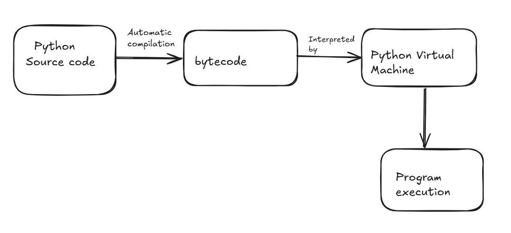

### Is Python interpreted or compiled language?

---
Python is both compiled and transpiled, though it is typically described as an interpreted language.

Here is what actually happens:
1. Compilation step: Python source code (.py files) is first compiled into bytecode (.pyc files) This happens automatically.
2. Interpretation step: The bytecode is then executed by the Python Virtual Machine (PVM) which interprets it line by line.

